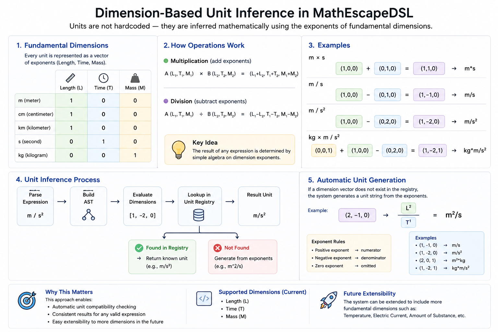

# MathDSL

> A domain-specific language (DSL) for mathematical expressions built with Java and ANTLR 4. The project implements a complete compiler pipeline, including parsing, semantic analysis, AST rewriting, interpretation, and mathematical dimension-based unit inference.

> **Academic Project**  
> Developed as part of the **Programming Languages** course.

---

# 📖 Overview

MathEscapeDSL is a custom Domain-Specific Language (DSL) designed for writing and evaluating mathematical expressions.

The project follows the architecture of a traditional compiler, implementing every major compilation stage from lexical analysis to interpretation. Instead of generating machine code, the language executes programs by interpreting an optimized Abstract Syntax Tree (AST).

One of its key features is a **dimension-based unit inference system**, which automatically derives the resulting physical units of mathematical expressions by tracking the exponents of fundamental dimensions rather than relying on predefined unit combinations.

---

# ✨ Features

- Custom mathematical DSL
- ANTLR 4 grammar
- Lexical analysis
- Syntax analysis
- Abstract Syntax Tree (AST)
- Semantic analysis
- Symbol table
- AST rewriting
- Expression interpreter
- Variables and functions
- Physical unit support
- Dimension-based unit inference
- Automatic unit generation
- Unit compatibility checking

---

# 🛠 Technology Stack

### Core

- Java 16
- Maven
- ANTLR 4

### Compiler Concepts

- Abstract Syntax Tree (AST)
- Visitor Pattern
- Symbol Table
- Semantic Analysis
- AST Rewriting
- Tree Interpretation

---

# 🏗 Compiler Architecture

```
Source Code
     │
     ▼
Lexer (ANTLR)
     │
     ▼
Parser (ANTLR)
     │
     ▼
Abstract Syntax Tree (AST)
     │
     ▼
Semantic Analyzer
     │
     ▼
Term Rewriter
     │
     ▼
Interpreter
     │
     ▼
Execution Result
```

---

# 📚 Main Components

## Grammar

The language syntax is defined using ANTLR 4 grammar rules, which automatically generate the lexer and parser.

---

## Abstract Syntax Tree (AST)

After parsing, source code is transformed into an Abstract Syntax Tree representing the logical structure of the program.

---

## Semantic Analyzer

The semantic analysis phase validates the parsed program by checking:

- Variable declarations
- Function definitions
- Type consistency
- Scope rules
- Unit compatibility

---

## Symbol Table

The symbol table stores identifiers such as variables and functions and provides scope-aware name resolution throughout compilation.

---

## Term Rewriter

Before execution, the AST passes through a rewriting stage.

The rewriter simplifies and normalizes expressions while preserving their semantics, producing a cleaner tree for the interpreter and separating transformation logic from execution.

---

## Interpreter

Instead of generating machine code, MathEscapeDSL evaluates the rewritten AST directly and produces the final execution result.

---

# ⭐ Dimension-Based Unit Inference

Unlike traditional systems that depend on predefined unit combinations, MathEscapeDSL represents physical units using **dimension vectors**.

Each unit is modeled using the exponents of the fundamental dimensions:

- Length
- Time
- Mass

Arithmetic operations manipulate these vectors mathematically:

- Multiplication → add exponents
- Division → subtract exponents

If no predefined unit exists in the registry, the language automatically generates an equivalent representation such as:

- `m/s²`
- `kg·m/s²`
- `m²/s`



---

# 📁 Project Structure

```text
src/
 ├── grammar
 ├── ast
 ├── semantic
 ├── symbol_table
 ├── unit
 ├── engine
 └── ui
```

---

# 🚀 Getting Started

Clone the repository:

```bash
git clone https://github.com/JOUD998/Math-DSL.git
```

Build the project:

```bash
mvn clean install
```
---

# 🎯 Highlights

- Complete compiler pipeline
- ANTLR-based parser
- AST-based execution
- Semantic validation
- AST rewriting
- Dimension-based unit inference
- Automatic physical unit generation

---

# 🔮 Future Improvements

- Additional optimization passes
- More mathematical functions
- Extended unit system
- Code generation backend
- IDE enhancements

---

# 📄 License

This project was developed for educational purposes as part of the **Programming Languages** course.
